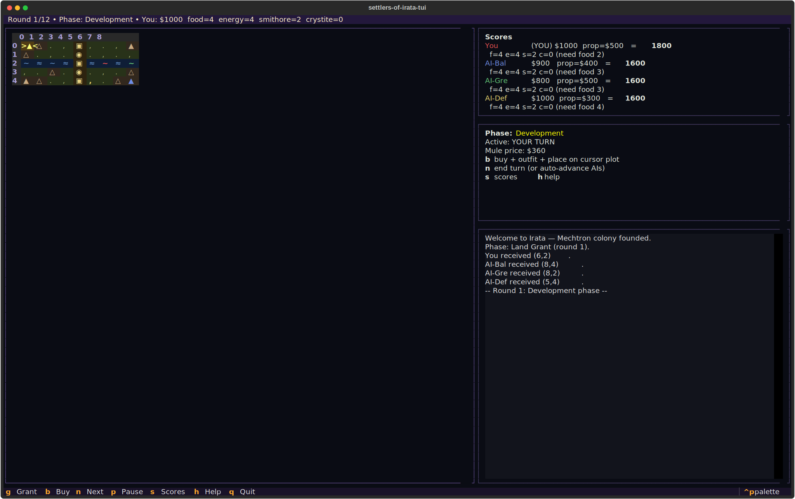
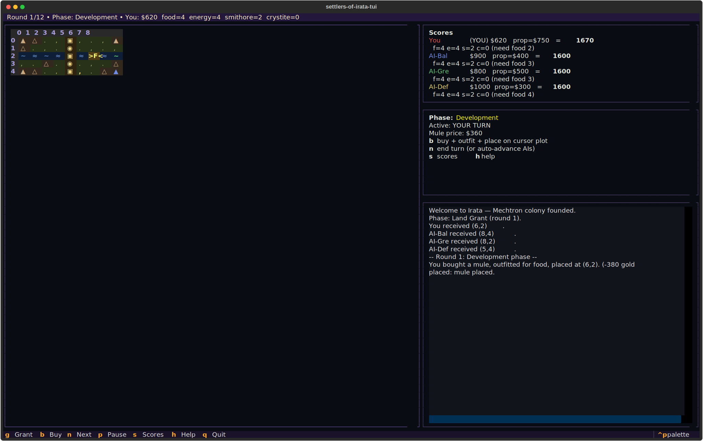
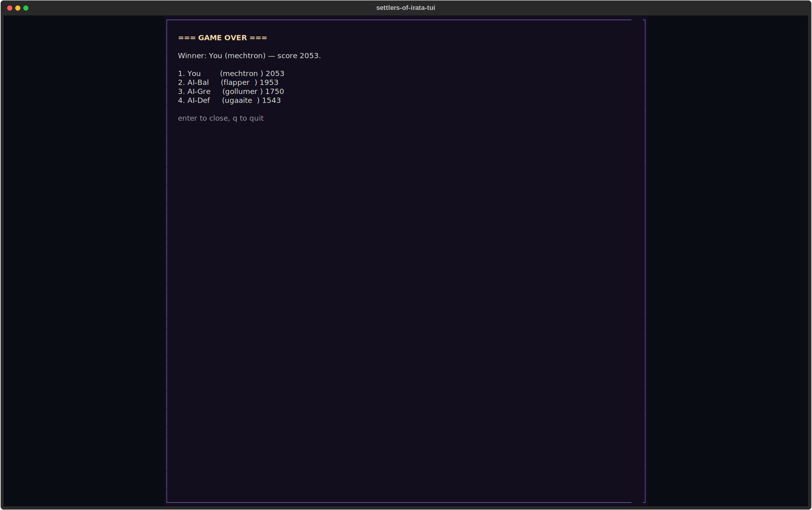

# settlers-of-irata-tui

> Inspired by M.U.L.E. (1983, Ozark Softscape / Electronic Arts). Trademarks belong to their respective owners. Unaffiliated fan project.

Only the ruthless prosper.





## About
Irata is a hostile world of crystal storms and killer bureaucracy. Four colonist races race to claim its riches before the crystite runs out. Outfit your M.U.L.E., stake a plot, auction your surplus — will your Mechtron corner the food market? Will the Flapper short the energy exchange? Only one pioneer will be crowned Most Valuable Colonist. The rest die in frontier debt.

## Screenshots


## Install & Run
```bash
git clone https://github.com/akakabrian/settlers-of-irata-tui
cd settlers-of-irata-tui
make
make run
```

## Controls
- `arrows` — move cursor on the 5×9 map
- `g` — claim the highlighted plot (Land Grant phase)
- `b` — buy + outfit + place a M.U.L.E. (Development phase)
- `n` — advance to the next phase (also runs AI turns)
- `p` — pause
- `s` — scoreboard
- `h` or `?` — help
- `q` — quit

You play **Player 1** (the Mechtron by default). Three AIs with
different policies (balanced / greedy / defensive) round out the table.
Highest score after 12 rounds wins.

## Testing
```bash
make test       # QA harness
make playtest   # scripted critical-path run
make perf       # performance baseline
```

## License
MIT

## Built with
- [Textual](https://textual.textualize.io/) — the TUI framework
- [tui-game-build](https://github.com/akakabrian/tui-foundry) — shared build process
